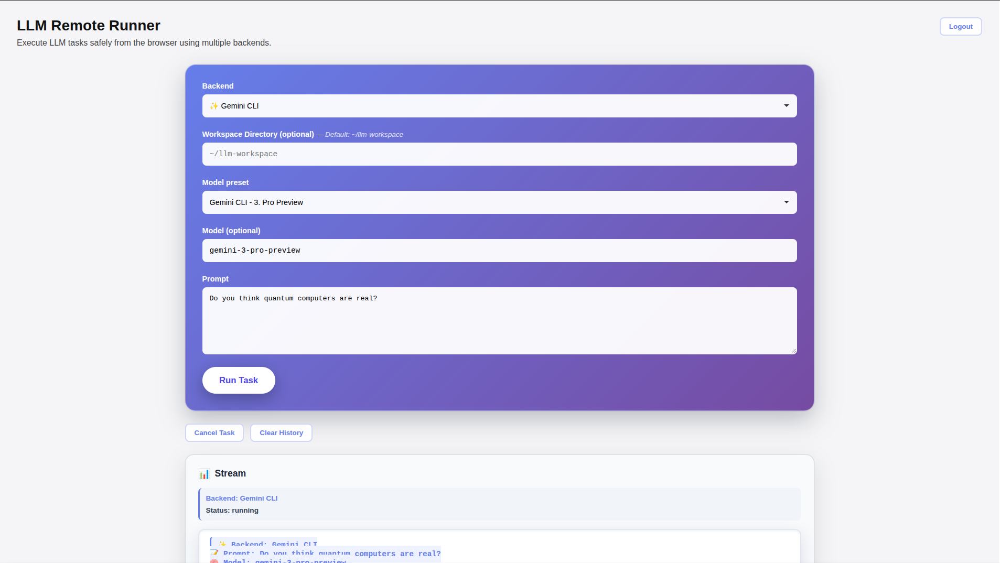

# LLM Remote Runner

> Execute LLM tasks remotely through a secure web interface with real-time streaming output.

This project was adapted from my other project: [Codex Remote Runner](https://github.com/EdwardAThomson/Codex-Remote-Runner)

[](https://www.typescriptlang.org/)
[](https://nestjs.com/)
[](https://nextjs.org/)
[](https://opensource.org/licenses/MIT)

## Overview

LLM Remote Runner is a full-stack application that provides a secure, web-based interface for executing LLM tasks through multiple backends. It features password-protected authentication, real-time streaming output, and a modern React UI.

### Supported Backends

**CLI Backends:**
- [Codex CLI](https://github.com/openai/codex-cli) (OpenAI)
- [Claude Code CLI](https://github.com/anthropics/claude-code) (Anthropic)
- [Gemini CLI](https://github.com/google-gemini/gemini-cli) (Google)

**API Backends:**
- OpenAI API (GPT-4, etc.)
- Anthropic API (Claude)
- Google Gemini API

**Note:** At least one CLI or API backend must be configured. CLI backends require the respective CLI tool to be installed and authenticated.


⚠️ **Warning** - This code has not been audited for security. Use at your own risk.




### Key Features

- 🔐 **Secure Authentication** - Password-based login with bcrypt hashing and JWT sessions
- 📡 **Real-time Streaming** - Server-Sent Events (SSE) for live task output
- 🎯 **Task Management** - Create, monitor, and cancel LLM tasks
- 🌐 **Modern UI** - Clean, responsive Next.js interface with TailwindCSS
- 🔧 **Flexible Configuration** - Customizable workspace directories and paths
- 📦 **Monorepo Architecture** - Well-organized codebase with shared SDK

## Architecture

This monorepo contains:

- **`gateway/`** – NestJS REST API with authentication and task management
- **`sdk/`** – Shared TypeScript SDK for API clients
- **`web/`** – Next.js web application with App Router
- **`mobile/`** – Expo React Native mobile app (experimental)
- **`infra/`** – Docker Compose and infrastructure configuration
- **`docs/`** – Comprehensive documentation

## Prerequisites

Before you begin, ensure you have:

- **Node.js** 18+ and **pnpm** 8+
- **At least one LLM backend** configured (CLI and/or API)
  - For Codex CLI (optional): Install with `npm install -g @openai/codex-cli` and authenticate with `codex auth`
  - For other CLI/API backends, see **Supported Backends** and **Environment Variables** below
- **Git** for cloning the repository

## Quick Start

### 1. Clone and Install

```bash
git clone https://github.com/EdwardAThomson/LLM-Remote-Runner.git
cd LLM-Remote-Runner

# Enable pnpm
corepack enable pnpm

# Install all dependencies
pnpm install --recursive
```

### 2. Configure Environment

```bash
# Copy example environment files
cp gateway/.env.example gateway/.env
cp web/.env.local.example web/.env.local
```

Edit `gateway/.env` and configure:

```bash
# Path to Codex binary (if you plan to use the Codex CLI backend)
CODEX_BIN_PATH=codex

# Default workspace for LLM tasks
DEFAULT_WORKSPACE=~/llm-workspace

# Generate a strong JWT secret
JWT_SECRET=$(openssl rand -base64 32)
```

### 3. Set Up Authentication

Run the interactive setup script to create your admin password:

```bash
cd gateway
pnpm tsx scripts/setup-auth.ts
```

The script will:
- Prompt for a password (minimum 16 characters recommended)
- Generate a bcrypt hash
- Save it to `gateway/.env`

**Security:** Delete the script after setup:
```bash
rm scripts/setup-auth.ts
```

⚠️ **Important:** The gateway will **refuse to start** if the setup script still exists. This prevents unauthorized password resets.

> 📖 See [`docs/AUTHENTICATION.md`](docs/AUTHENTICATION.md) for detailed authentication setup and security best practices.

### 4. Start the Application

Run both services in separate terminals:

**Terminal 1 - Backend API:**
```bash
cd gateway
pnpm dev
```

**Terminal 2 - Web UI:**
```bash
cd web
pnpm dev
```

### 5. Create Default Workspace (Optional)

The default workspace directory is `~/llm-workspace`. Create it if it doesn't exist:

```bash
mkdir -p ~/llm-workspace
```

**Note:** You can override this per-task in the web UI, or change the default in `gateway/.env` (`DEFAULT_WORKSPACE`).

### 6. Access the Application

1. Open your browser to **http://localhost:3001**
2. Log in with your admin password
3. Start executing LLM tasks with your configured backend(s)!

## Usage

### Web Interface

1. **Login** - Enter your admin password
2. **Set Workspace** - Specify the working directory for the selected backend
   - Leave empty to use default: `~/llm-workspace`
   - Or specify a custom path (e.g., `~/my-project`)
3. **Enter Prompt** - Describe the task for the selected LLM backend
4. **Submit** - Watch real-time output as the backend executes
5. **Review** - Output history is preserved for the session

### API Usage

You can also interact with the API directly:

```bash
# Login to get session token
curl -X POST http://localhost:3000/api/auth/login \
  -H "Content-Type: application/json" \
  -d '{"password":"your-password"}'

# Create a task (with backend selection)
curl -X POST http://localhost:3000/api/tasks \
  -H "Authorization: Bearer YOUR_TOKEN" \
  -H "Content-Type: application/json" \
  -d '{"prompt":"Create a hello world script","cwd":"/path/to/workspace","backend":"codex"}'

# Stream task output
curl -N http://localhost:3000/api/tasks/TASK_ID/stream?token=YOUR_TOKEN
```

> 📖 See [`RUNNING.md`](RUNNING.md) for detailed API documentation and examples.

## Configuration

### Environment Variables

#### Gateway (`gateway/.env`)

| Variable | Description | Default | Required |
|----------|-------------|---------|----------|
| `PORT` | Gateway server port | `3000` | No |
| `JWT_SECRET` | Secret for signing JWT tokens | - | Yes |
| `JWT_ISSUER` | JWT token issuer | `codex-remote-runner` | No |
| `ADMIN_PASSWORD_HASH` | Bcrypt hash of admin password | - | Yes |
| `DEFAULT_WORKSPACE` | Default workspace directory | `~/llm-workspace` | Yes |
| `RATE_LIMIT_POINTS` | Max requests per duration | `60` | No |
| `RATE_LIMIT_DURATION` | Rate limit window (seconds) | `60` | No |
| `TASK_HEARTBEAT_MS` | SSE heartbeat interval | `15000` | No |

**CLI Backend Paths:**

| Variable | Description | Default | Required |
|----------|-------------|---------|----------|
| `CODEX_BIN_PATH` | Path to Codex binary | `codex` | No* |
| `CLAUDE_BIN_PATH` | Path to Claude Code binary | `claude` | No* |
| `GEMINI_BIN_PATH` | Path to Gemini CLI binary | `gemini` | No* |

**API Backend Keys:**

| Variable | Description | Default | Required |
|----------|-------------|---------|----------|
| `OPENAI_API_KEY` | OpenAI API key | - | No* |
| `ANTHROPIC_API_KEY` | Anthropic API key | - | No* |
| `GEMINI_API_KEY` | Google Gemini API key | - | No* |

*At least one backend (CLI or API) must be configured.

#### Web (`web/.env.local`)

| Variable | Description | Default | Required |
|----------|-------------|---------|----------|
| `NEXT_PUBLIC_GATEWAY_URL` | Gateway API URL | `http://localhost:3000` | Yes |

## Development

### Project Structure

```
LLM-Remote-Runner/
├── gateway/          # NestJS backend API
│   ├── src/
│   │   ├── auth/     # Authentication module
│   │   ├── tasks/    # Task management module
│   │   └── config/   # Configuration
│   └── scripts/      # Setup scripts
├── web/              # Next.js frontend
│   ├── app/          # App Router pages
│   ├── components/   # React components
│   └── lib/          # Utilities and SDK wrapper
├── sdk/              # Shared TypeScript SDK
├── mobile/           # React Native app (experimental)
├── infra/            # Infrastructure config
└── docs/             # Documentation
```

### Testing

```bash
# Run gateway tests
pnpm --filter @codex/gateway test

# Run with coverage
pnpm --filter @codex/gateway test -- --coverage
```

### Building for Production

```bash
# Build all packages
pnpm build --recursive

# Build specific package
pnpm --filter @codex/gateway build
pnpm --filter @codex/web build
```
## Security Considerations
  
 ⚠️ **Important:** This application may execute arbitrary code via configured LLM backends (especially CLI tools like Codex). Follow these security practices:
  
  ### Development
  - ✅ Use strong passwords (16+ characters)
  - ✅ Keep `.env` files in `.gitignore`
  - ✅ Run on `localhost` only
  - ✅ Delete setup script after configuration
  
  ### Production
  - 🔒 **Use HTTPS** - Configure reverse proxy with SSL/TLS
  - 🔒 **Change all secrets** - Generate new JWT_SECRET and admin password
  - 🔒 **Restrict CORS** - Update allowed origins in `gateway/src/main.ts`
  - 🔒 **Use environment variables** - Not `.env` files (use Docker secrets, K8s secrets, etc.)
  - 🔒 **Firewall rules** - Restrict gateway port access
  - 🔒 **Regular updates** - Keep dependencies up to date
  - 🔒 **Monitor logs** - Watch for unauthorized access attempts
  
  > 📖 See [`docs/AUTHENTICATION.md`](docs/AUTHENTICATION.md) for comprehensive security guidance.

  ### Frontend dependency notes

  The web UI currently uses **React 18** and **Next.js 14** (see `web/package.json`). Known issues like **CVE-2025-55182**, which target **React 19.x Server Components** and frameworks embedding those RSC packages, do not apply to this setup.

  If you upgrade to **React 19 / Next 19** in the future, re-check the relevant security advisories and ensure you are on patched versions before deploying.
  
  ## Documentation

- **[AUTHENTICATION.md](docs/AUTHENTICATION.md)** - Authentication setup and security
- **[RUNNING.md](RUNNING.md)** - Detailed setup and API documentation
- **[plan.md](plan.md)** - Project planning and architecture
- **[spec.md](spec.md)** - Technical specifications

## Troubleshooting

### "Authentication not configured" error

Run the setup script:
```bash
cd gateway
pnpm tsx scripts/setup-auth.ts
```

### Gateway won't start

Check that:
- Port 3000 is available
- All environment variables are set in `gateway/.env`
- Required CLI backends (for example, Codex, Claude Code, Gemini CLI) are installed and in PATH if you use them

### Web app can't connect to gateway

Verify:
- Gateway is running on port 3000
- `NEXT_PUBLIC_GATEWAY_URL` in `web/.env.local` is correct
- No CORS issues (check browser console)

### Task fails with "directory not found" or permission errors

The default workspace directory may not exist:
```bash
mkdir -p ~/llm-workspace
chmod 755 ~/llm-workspace
```

Or specify a different directory in the web UI workspace field.

## License

This project is licensed under the MIT License - see the [LICENSE](LICENSE) file for details.

## Acknowledgments

- Built with [NestJS](https://nestjs.com/), [Next.js](https://nextjs.org/), and [Codex CLI](https://github.com/openai/codex-cli)
- Authentication powered by [bcrypt](https://github.com/kelektiv/node.bcrypt.js) and [Passport](http://www.passportjs.org/)
- UI styled with [TailwindCSS](https://tailwindcss.com/)


---

**Note:** At least one LLM backend (CLI or API) must be configured. See the Environment Variables section for setup details.
